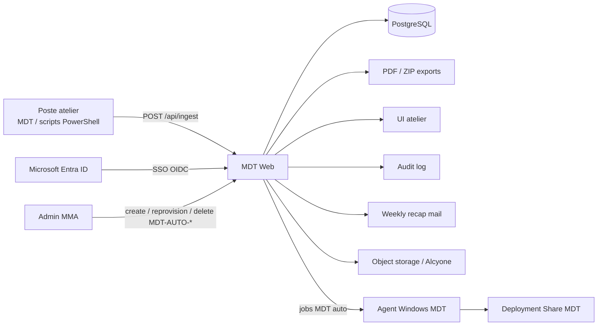
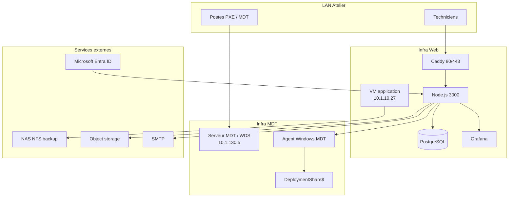
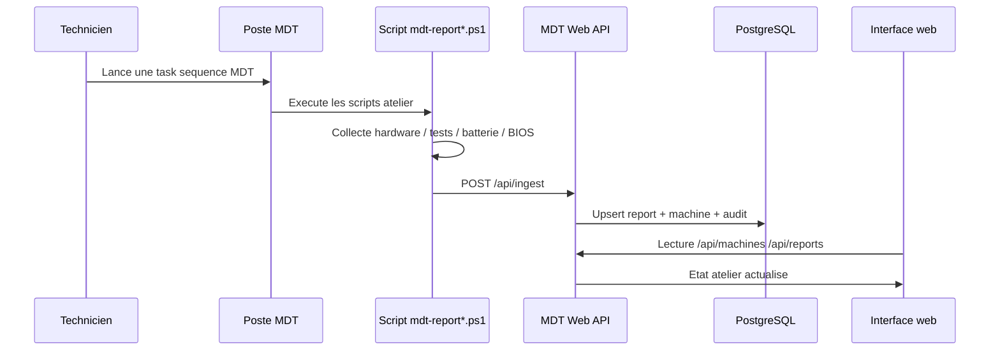
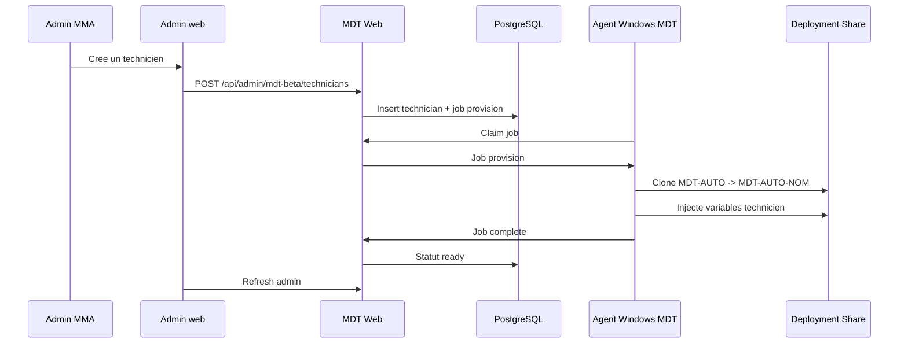
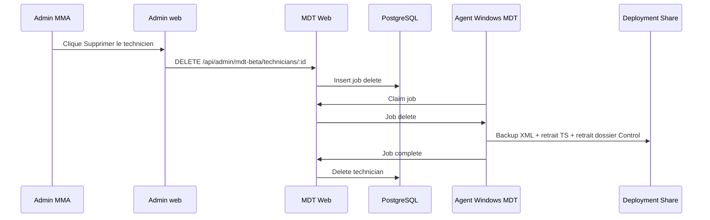
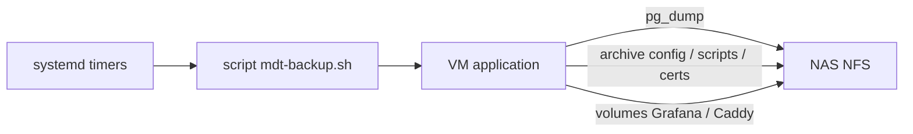
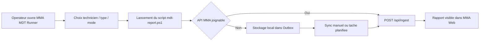

# MDT Web

Plateforme de suivi atelier pour les postes traites via MDT.

Le projet couvre :
- l'ingestion des rapports materiels postes
- l'interface web de pilotage atelier
- l'authentification Microsoft Entra ID
- la gestion des lots, palettes, alertes, PDF et audit
- l'automatisation MDT "MDT-AUTO-*" via un agent Windows
- les backups et la restauration de la production

## Etat actuel

Oui, le code de l'agent Windows est dans ce depot et dans GitHub.

Fichiers principaux :
- [scripts/beta/mma-mdt-agent.ps1](/home/linus/mdt-web/scripts/beta/mma-mdt-agent.ps1)
- [scripts/beta/provision-mdt-beta.ps1](/home/linus/mdt-web/scripts/beta/provision-mdt-beta.ps1)
- [scripts/beta/remove-mdt-beta.ps1](/home/linus/mdt-web/scripts/beta/remove-mdt-beta.ps1)
- [scripts/beta/mma-mdt-agent.sample.json](/home/linus/mdt-web/scripts/beta/mma-mdt-agent.sample.json)
- [scripts/beta/mdt-report-beta.ps1](/home/linus/mdt-web/scripts/beta/mdt-report-beta.ps1)

Back-end principal :
- [server.js](/home/linus/mdt-web/server.js)

Admin web MDT auto :
- [public/admin.html](/home/linus/mdt-web/public/admin.html)
- [public/admin.js](/home/linus/mdt-web/public/admin.js)

## Vue d'ensemble



## Architecture technique

### Composants

| Composant | Role | Code |
| --- | --- | --- |
| `mdt-web` | API, UI, auth, PDF, audit, automation MDT | [server.js](/home/linus/mdt-web/server.js) |
| `postgres` | base de donnees metier | Docker volume `mdt-db` |
| `web-https` | reverse proxy HTTPS Caddy | [docker-compose.yml](/home/linus/mdt-web/docker-compose.yml) |
| `grafana` | dashboards et supervision | [docker-compose.yml](/home/linus/mdt-web/docker-compose.yml) |
| agent Windows MDT | execution des jobs `provision` / `delete` | [scripts/beta/mma-mdt-agent.ps1](/home/linus/mdt-web/scripts/beta/mma-mdt-agent.ps1) |

### Topologie de production



## Fonctionnalites principales

- suivi temps reel des postes atelier
- detail machine avec historique des passages
- creation manuelle de rapports
- gestion des lots et des palettes
- import logistique CSV et export ZIP de PDF
- alertes batterie faible et derive RTC / pile BIOS
- recap hebdo pour les admins
- journal d'audit
- SSO Microsoft Entra ID avec RBAC par groupes
- automatisation MDT pour creer/supprimer des TS `MDT-AUTO-*`

## Flux fonctionnels

### 1. Remontee MDT classique



### 2. Creation d'un technicien MDT auto



### 3. Suppression d'un technicien MDT auto



### 4. Backups de production



## Authentification et droits

### Authentification

Le mode cible est Microsoft Entra ID.

Le code prend en charge :
- SSO OIDC Microsoft
- mapping des droits par groupes Entra
- fallback admin local optionnel selon la configuration

Variables principales :
- `MICROSOFT_ENTRA_TENANT_ID`
- `MICROSOFT_ENTRA_CLIENT_ID`
- `MICROSOFT_ENTRA_CLIENT_SECRET`
- `MICROSOFT_ENTRA_REDIRECT_URI`

### RBAC

L'application mappe des groupes Microsoft vers des niveaux d'acces :
- `reader`
- `operator`
- `logistics`
- `admin`
- `platformAdmin`

Variables :
- `MICROSOFT_READER_GROUP_IDS`
- `MICROSOFT_OPERATOR_GROUP_IDS`
- `MICROSOFT_LOGISTICS_GROUP_IDS`
- `MICROSOFT_ADMIN_GROUP_IDS`
- `MICROSOFT_PLATFORM_ADMIN_GROUP_IDS`

## Automatisation MDT-AUTO

### Principe

L'automatisation ne modifie pas les anciennes TS atelier historiques.

Elle repose sur :
- un template cache `MDT-AUTO`
- un groupe cible `MMA Beta`
- des TS generees `MDT-AUTO-<TECHNICIEN>`
- un agent Windows qui fait les operations sur le serveur MDT

### Convention

- ID TS generee : `MDT-AUTO-NOM`
- Nom visible TS : `MDT-AUTO-Nom`
- groupe MDT : `MMA Beta`
- dossier de scripts beta : `Scripts\\marl\\beta`

### Variables technicien injectees

Le script beta ne depend plus du nom de la TS.

La TS injecte explicitement :
- `MMA_TECHNICIAN`
- `MDT_TECHNICIAN`

Le script [scripts/beta/mdt-report-beta.ps1](/home/linus/mdt-web/scripts/beta/mdt-report-beta.ps1) lit ces variables en priorite.

### Code de l'agent Windows

Fichiers :
- [scripts/beta/mma-mdt-agent.ps1](/home/linus/mdt-web/scripts/beta/mma-mdt-agent.ps1)
- [scripts/beta/provision-mdt-beta.ps1](/home/linus/mdt-web/scripts/beta/provision-mdt-beta.ps1)
- [scripts/beta/remove-mdt-beta.ps1](/home/linus/mdt-web/scripts/beta/remove-mdt-beta.ps1)
- [scripts/beta/mma-mdt-agent.sample.json](/home/linus/mdt-web/scripts/beta/mma-mdt-agent.sample.json)

Rendu en production sur le serveur MDT :
- `C:\\ProgramData\\MMA\\MdtBetaAgent\\mma-mdt-agent.ps1`
- `C:\\ProgramData\\MMA\\MdtBetaAgent\\provision-mdt-beta.ps1`
- `C:\\ProgramData\\MMA\\MdtBetaAgent\\remove-mdt-beta.ps1`
- `C:\\ProgramData\\MMA\\MdtBetaAgent\\mma-mdt-agent.json`

### Cycle de vie d'un job agent

- `queued`
- `running`
- `succeeded`
- `failed`

Types de jobs actuellement supportes :
- `provision`
- `delete`

## Donnees metier

Tables importantes :
- `reports`
- `machines`
- `lots`
- `lot_assignments`
- `pallets`
- `patchnotes`
- `suggestions`
- `audit_log`
- `weekly_recap_runs`
- `mdt_beta_technicians`
- `mdt_beta_jobs`
- `mdt_beta_agents`

## Batterie / alertes / BIOS

Le projet gere :
- sante batterie
- charge batterie
- fallback `Win32_Battery.EstimatedChargeRemaining`
- statut explicite `batteryStatus = not_tested` si WMI batterie est absent
- alertes batterie faible
- alertes derive RTC / pile BIOS suspecte

Variables principales :
- `BATTERY_ALERT_THRESHOLD`
- `BIOS_CLOCK_DRIFT_ALERT_THRESHOLD_SECONDS`
- `BIOS_CLOCK_DELTA_ALERT_THRESHOLD_SECONDS`

## Weekly recap admin

Le recap hebdo s'appuie sur l'audit et les donnees de production.

Variables principales :
- `WEEKLY_RECAP_ENABLED`
- `WEEKLY_RECAP_RECIPIENTS`
- `WEEKLY_RECAP_FROM`
- `WEEKLY_RECAP_DAY`
- `WEEKLY_RECAP_HOUR`
- `WEEKLY_RECAP_MINUTE`
- `WEEKLY_RECAP_TIMEZONE`
- `WEEKLY_RECAP_BATTERY_THRESHOLD`

## Object storage

Le projet sait publier des artefacts bruts sur un stockage objet compatible S3 / MinIO.

Variables principales :
- `OBJECT_STORAGE_ENDPOINT`
- `OBJECT_STORAGE_BUCKET`
- `OBJECT_STORAGE_ACCESS_KEY`
- `OBJECT_STORAGE_SECRET_KEY`
- `OBJECT_STORAGE_PREFIX`
- `OBJECT_STORAGE_CONSOLE_URL`
- `OBJECT_STORAGE_BROWSER_PATH`
- `OBJECT_STORAGE_RENAME_ON_TAG`

## Lancement local

### Node simple

```bash
npm install
npm start
```

### Docker Compose

```bash
docker compose up -d
```

Services exposes localement :
- app : `http://localhost:3000`
- postgres : `localhost:5432`
- grafana : `http://localhost:3002`

## Variables d'environnement importantes

### Web / session

- `PORT`
- `DATABASE_URL`
- `SESSION_SECRET`
- `SESSION_NAME`
- `COOKIE_SECURE`
- `TRUST_PROXY`
- `FORCE_HTTPS`
- `HTTPS_PUBLIC_ORIGIN`

### SSO Microsoft

- `MICROSOFT_ENTRA_TENANT_ID`
- `MICROSOFT_ENTRA_CLIENT_ID`
- `MICROSOFT_ENTRA_CLIENT_SECRET`
- `MICROSOFT_ENTRA_REDIRECT_URI`

### RBAC Microsoft

- `MICROSOFT_READER_GROUP_IDS`
- `MICROSOFT_OPERATOR_GROUP_IDS`
- `MICROSOFT_LOGISTICS_GROUP_IDS`
- `MICROSOFT_ADMIN_GROUP_IDS`
- `MICROSOFT_PLATFORM_ADMIN_GROUP_IDS`

### MDT auto

- `MDT_BETA_AGENT_TOKEN`
- `MDT_BETA_DEFAULT_SOURCE_TASK_SEQUENCE_ID`
- `MDT_BETA_GROUP_NAME`
- `MDT_BETA_SCRIPTS_FOLDER`
- `MDT_BETA_JOB_RUNNING_TIMEOUT_MS`

### Weekly recap

- `WEEKLY_RECAP_ENABLED`
- `WEEKLY_RECAP_RECIPIENTS`
- `WEEKLY_RECAP_TIMEZONE`

### Alertes

- `BATTERY_ALERT_THRESHOLD`
- `BIOS_CLOCK_DRIFT_ALERT_THRESHOLD_SECONDS`
- `BIOS_CLOCK_DELTA_ALERT_THRESHOLD_SECONDS`

## MMA MDT Runner

Le depot contient maintenant un flux local Windows pour relancer les checks atelier sans reboot PXE.

Objectif :
- relancer tous les checks depuis Windows deja demarre
- choisir le technicien manuellement
- envoyer le rapport vers MMA quand l'API est disponible
- stocker localement le rapport quand le poste ou le serveur est hors ligne
- ne lancer la reinitialisation usine que sur demande explicite

### Principe fonctionnel



### Comportement cle

- le script de base `scripts/mdt-report.ps1` ne force plus la reinitialisation en fin d'execution
- la reinitialisation est exposee comme option explicite dans l'application locale
- si l'upload echoue, le payload peut etre ecrit dans une file locale `Outbox`
- la resynchronisation est geree par `scripts/mdt-outbox-sync.ps1`

### Arborescence cible sur le poste Windows

```text
C:\Program Files\MMA Automation\MdtRunner\
├── MmaMdtRunner.ps1
├── MmaMdtRunner.Common.ps1
├── config.json
├── technicians.json
└── scripts\
    ├── mdt-report.ps1
    ├── mdt-desktop.ps1
    ├── mdt-laptop.ps1
    ├── mdt-stress.ps1
    ├── mdt-outbox-sync.ps1
    ├── keyboard_capture.ps1
    └── camera.exe
```

### Donnees locales du runner

```text
C:\ProgramData\MMA\MdtRunner\
├── Logs\
└── Outbox\
    ├── pending\
    ├── sent\
    └── failed\
```

### Packaging

- les sources du runner sont dans `windows-runner/`
- le packaging MSI est defini dans `windows-runner/installer/MmaMdtRunner.wxs`
- un template Linux `wixl` est disponible dans `windows-runner/installer/MmaMdtRunner.wixl.wxs`
- le script de build est `windows-runner/build-msi.ps1`
- le build Linux local est `windows-runner/build-msi.sh`
- la tache de synchronisation optionnelle est `windows-runner/Register-MmaMdtRunnerSyncTask.ps1`

## Espace FOG

Les scripts, artefacts et la documentation FOG ont ete externalises dans le depot `fog-web` afin de garder ce depot centre sur MDT.

## Structure du depot

```text
.
├── server.js
├── docker-compose.yml
├── public/
│   ├── index.html
│   ├── app.js
│   ├── admin.html
│   └── admin.js
├── scripts/
│   ├── mdt-report-*.ps1
│   ├── mdt-outbox-sync.ps1
│   └── beta/
│       ├── mma-mdt-agent.ps1
│       ├── provision-mdt-beta.ps1
│       ├── remove-mdt-beta.ps1
│       └── mdt-report-beta.ps1
├── windows-runner/
│   ├── MmaMdtRunner.ps1
│   ├── MmaMdtRunner.Common.ps1
│   ├── config.sample.json
│   ├── technicians.json
│   └── installer/
├── caddy/
├── certs/
└── grafana/
```

## Exploitation

### VM application

Deploiement actuel :
- repertoire : `/etc/mdt-fusion/main`
- service principal : `mdt-web`
- reverse proxy : `web-https`

Commandes utiles :

```bash
cd /etc/mdt-fusion/main
sudo docker compose ps
curl http://127.0.0.1:3000/api/health
curl -k https://127.0.0.1/api/health
sudo docker logs --tail 100 mdt-mdt-web-1
```

### Serveur MDT Windows

Points utiles :
- share MDT : `W:\\DeploymentShare`
- share reseau : `\\\\CAPR-MDT-01\\DeploymentShare$`
- share WDS : `W:\\RemoteInstall`
- agent : `C:\\ProgramData\\MMA\\MdtBetaAgent`

## Backups et restauration

La production dispose d'un systeme de backup vers un partage NFS NAS.

Principes :
- dump PostgreSQL
- archive config / code / scripts / certs
- sauvegarde des volumes utiles
- rotation journaliere / hebdo / mensuelle

Scripts de la VM application :
- `/usr/local/sbin/mdt-backup.sh`
- `/usr/local/sbin/mdt-restore.sh`

Montage NFS :
- `/mnt/mdt-backup`

## Depannage rapide

### PXE charge mais le wizard bloque sur la liste des TS

Verifier :
- `W:\\DeploymentShare\\Control\\TaskSequences.xml`
- `W:\\DeploymentShare\\Control\\TaskSequenceGroups.xml`
- les libelles TS anormalement longs ou corrompus
- les services WDS sur le serveur MDT

### Un technicien reste en attente dans l'admin

Verifier :
- heartbeat agent dans l'admin
- log `C:\\ProgramData\\MMA\\MdtBetaAgent\\logs\\agent.log`
- job queue `mdt_beta_jobs`

### Une TS MDT-AUTO n'apparait pas

Verifier :
- `hide="False"` dans `TaskSequences.xml`
- groupe `MMA Beta`
- presence du dossier `Control\\MDT-AUTO-*`

### La remontee batterie est vide

Verifier :
- classes WMI batterie
- fallback `Win32_Battery`
- payload JSON du rapport

### Le script MDT echoue sur `execute report script`

Verifier :
- `smsts.log`
- presence du script sur le desktop
- chemin du script dans `TS.xml`

## Notes importantes

- Le README de fevrier n'etait plus representatif de la prod.
- L'automatisation MDT auto est bien versionnee dans GitHub.
- Les modifications de prod ne doivent pas etre faites a la main dans `TaskSequences.xml` sans backup.
- Le template cache `MDT-AUTO` doit rester reserve a l'automatisation.

## Fichiers de reference

- application : [server.js](/home/linus/mdt-web/server.js)
- admin MDT : [public/admin.js](/home/linus/mdt-web/public/admin.js)
- agent Windows : [scripts/beta/mma-mdt-agent.ps1](/home/linus/mdt-web/scripts/beta/mma-mdt-agent.ps1)
- provision MDT : [scripts/beta/provision-mdt-beta.ps1](/home/linus/mdt-web/scripts/beta/provision-mdt-beta.ps1)
- suppression MDT : [scripts/beta/remove-mdt-beta.ps1](/home/linus/mdt-web/scripts/beta/remove-mdt-beta.ps1)
